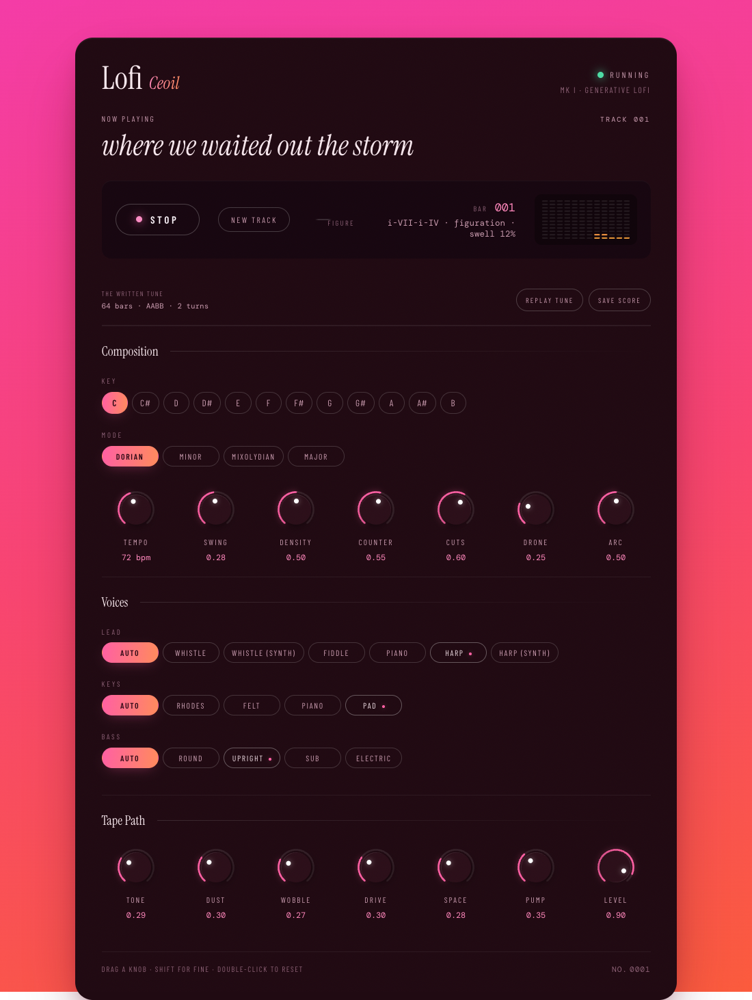

# Lofi Ceoil

A browser instrument that generates endless lofi with an Irish accent, and lets you shape it while it plays.

*Ceoil* — of music.

**[▶ Play it](https://germcauley.github.io/lofi-ceoil/)** — no install, no sign-up. Press start and turn things.



Everything is synthesised in the browser with [Tone.js](https://tonejs.github.io/). There are no audio files, no samples, and no server — the whole thing is about 280 kB of JavaScript and it will run forever without repeating itself.

## What it actually does

Most generative lofi toys roll new random notes every bar, which produces noodling rather than music. This one writes **phrases**.

On each sixteen-bar cycle it composes two four-bar phrases and plays them as **AABB** — phrase A, a varied repeat of A, phrase B, a varied repeat of B. Hearing a shape come back is what makes a melody sound like a melody instead of a random walk, and varying the repeat instead of replacing it is how a player would actually handle a tune.

The melodic grammar leans Celtic and folk:

- **Gapped note pools.** Rather than the full seven-note scale, melodies draw on pentatonic and hexatonic subsets, which is what most Irish and Scottish tunes actually use. Dorian and mixolydian keep their characteristic sixth and flat seventh.
- **Stepwise motion.** Intervals are weighted heavily toward steps, with fourths and fifths as occasional events rather than the default. Random intervals sound random; weighted ones sound sung.
- **Arched contour.** Each phrase rises toward a peak bar and falls back, coming to rest on the tonic. That cadence is what makes a phrase sound finished.
- **Cuts.** Fast grace notes flicked in above the main note. This single ornament does more for the folk character than any amount of note choice.

There is a second line too — an arpeggiated counter-melody rather than static accompaniment. Three rules keep it musical instead of busy:

- **It arpeggiates the actual chord**, so it is consonant with the harmony rather than merely in key.
- **One figure per phrase.** Six shapes — up, down, up-down, alberti, pendulum, rolling — chosen once and held for four bars. A repeating figure reads as accompaniment; a fresh note order every bar reads as fidgeting.
- **Complementary rhythm.** It maps where the melody is sounding and plays into the rests. This is the part that makes two lines sound like a duet instead of a pile.

It also runs in contrary motion: when the melody climbs across a phrase, the figure runs backwards.

Underneath, chords come from a table of progressions written in roman numerals, so they transpose to any key and mode for free. A pipe-like drone holds the fifth. The drums swing, humanise their timing, and duck the whole mix on every kick.

Then the tape path ruins it pleasantly: saturation, parallel bitcrushing, wow and flutter, a lowpass, reverb, and a bed of vinyl hiss and crackle that never pumps, because a record surface doesn't.

## The controls

Drag a knob vertically. Hold **shift** for fine adjustment, **double-click** to reset, scroll to nudge. Everything responds while it plays. **Space** starts and stops.

| Composition | |
|---|---|
| **tempo** | 55–95 bpm |
| **swing** | how far the offbeats lean |
| **density** | how busy the drums and melody get |
| **counter** | how much the arpeggiated second line plays |
| **cuts** | how often notes get ornamented |
| **drone** | the sustained fifth underneath |

| Tape path | |
|---|---|
| **tone** | lowpass cutoff — muffled to open |
| **dust** | bitcrush, bit depth and vinyl noise together |
| **wobble** | wow and flutter depth |
| **drive** | tape saturation |
| **space** | reverb |
| **pump** | how hard the kick ducks the mix |
| **level** | output |

Key and mode are buttons. Changing mode rebuilds the phrase, since a tune written for dorian doesn't belong in major.

## Running it locally

```bash
npm install && npm run dev
```

Then open `http://localhost:5173`. Node 22 or later.

## Where things live

The code is organised so that each file answers one question.

| File | What it decides |
|---|---|
| [`src/theory.js`](src/theory.js) | Scales, chord voicings, and the progression table. **The highest-leverage file** — adding a progression here changes what the machine sounds like more than anything else. |
| [`src/melody.js`](src/melody.js) | Phrase construction: gapped pools, interval weighting, contour, ornaments, AABB variation, and the counter-line figures. |
| [`src/parts.js`](src/parts.js) | What each instrument plays in a given bar. |
| [`src/instruments.js`](src/instruments.js) | The synth voices. Each exposes `triggerAttackRelease`, which is also the `Tone.Sampler` interface, so swapping any voice for real samples is a one-function change. |
| [`src/effects.js`](src/effects.js) | The tape path and the sidechain duck. |
| [`src/engine.js`](src/engine.js) | Audio graph, live state, and bar scheduling. |
| [`src/knob.js`](src/knob.js) | The rotary control. Pointer, wheel, and keyboard, with the standard slider role. |
| [`src/meter.js`](src/meter.js) | The segmented LED spectrum display, driven by a real FFT of the output. Colours are read from CSS custom properties, so the palette stays in one place. |

In development, `window.lofi` is exposed — `lofi.controls.dust(0.9)` works from the console.

## Notes for anyone extending it

Tone's monophonic voices — `MonoSynth`, `Synth`, `NoiseSynth` — reject events scheduled out of order, and they do it by throwing. If you add a part that can place two notes at overlapping times on one voice, either give it its own voice or sort and space the events first. Both bugs found while building this were exactly that.

## Design

The whole palette lives in `:root` at the top of [`src/style.css`](src/style.css) — page gradient, panel, ink, accents, and the two LED colours. Restyling is about fifteen values.

## Licence

MIT. The code is original; nothing is derived from another generator.
